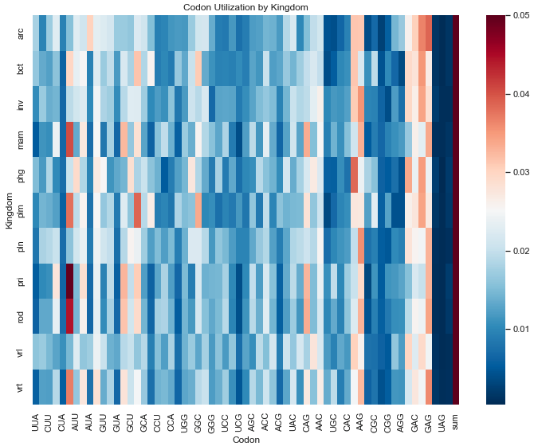

# Classification of biological organisms based on their codon usage frequencies

This project aims to correctly classify organisms to their correct kingdoms based on their codon usage frequencies.  As observed in the chart below, different kingdoms of organisms exhibit codons relating to amino acid expression at different frequencies.  These codon frequencies can subsequently be used as a feature to classify organisms into their proper kingdoms through machine learning and deep learning given a table of codon frequencies.  

At present, classification models have been trained using sklearn's **Random Forest Classifier** and **Support Vector Machines Classifier** as well as a **Deep Neural Network** in Keras. The top performing model is the **Keras Neural Network**, with an accuracy score of just over 94%.  

Given any DNA sequence, we can extract the codon frequencies for each of the 64 codons.  Using these codon frequencies, the model will able to predict the kingdom of the organism in question.  The next step in the process will be to write the functions that can turn raw DNA sequence data into codon frequency data using both original code and the [biopython](https://biopython.org/docs/1.75/api/index.html) API.

Data has been sourced from the [UCI Machine Learning Repository](https://archive.ics.uci.edu/ml/datasets/Codon+usage)
